[Purpose](#purpose)  

[Prerequisites](#prerequisites)  

[Step 1: Install a Nuxeo Server ](#step-1)    

[Step 2: Install Mule Nuxeo Connector from update Site](#step-2)   

[Step 3: Create Demo Project](#step-3)  

[Step 4: Implement a flow that uploads a file in Nuxeo](#step-4)

[Step 5: Playing with datasense: Exporting some of the repository content in XML](#step-5)

[Step 6: Playing with DataSense: Importing content from a flat file in the repository](#step-6)

[Step 7: Listening to events happening in a Nuxeo instance, from Mule](#step-7)

[Other Resources](#other)    

### Purpose

This document provides detailed instructions on how to install Nuxeo Connector for Mule and demonstrates how to build and run simple demo application that uses this connector.

### Prerequisites

In order to build and run this project you'll need:

* a Nuxeo server
     - You can [download](http://www.nuxeo.com/en/downloads) and [install](http://doc.nuxeo.com/display/ADMINDOC/Installation) a server 
     - You can run against the public [Nuxeo demo server](http://demo.nuxeo.com/nuxeo/)
     - You can use a nuxeo.io instance

* [MuleStudio](http://www.mulesoft.org/download-mule-esb-community-edition).

* Web browser.

### Step 1: Install a Nuxeo Server

Follow instructions on [Adminsitration and Installation](http://doc.nuxeo.com/display/public/ADMINDOC/Installation) documentation of Nuxeo. You may also want to customize your Nuxeo Set up using [Nuxeo Studio](http://doc.nuxeo.com/x/bgTF).

### Step 2: Install Mule Nuxeo Connector from update Site

*    In Mule Studio select **Help** \> **Install New Software...**.

*    Select **MuleStudio Cloud Connectors Update Site** in **Work With** drop-down.

*    Check one item from Community folder: **Nuxeo Connector** and click **Next**.

*    Follow installation steps.

Alternatively, you can usee the [update site provided by Nuxeo QA](https://qa.nuxeo.org/jenkins/job/nuxeo-mule-connector-master/lastSuccessfulBuild/artifact/target/update-site/)

### Step 3: Create Demo project

1.    Run Mule Studio and select **File \> New \> Mule Project** menu item. 

1.    Type **Demo** as a project name.

1.    Select CloudHub Mule Runtime for Server Runtime property.

1.    Click **Next** twice

1.    You should be using jdk 1.7 - if not make sure to install it

1.    Click next once again then click **finnish** to end up the wizzard. You should now be in front of an empty flow editor.

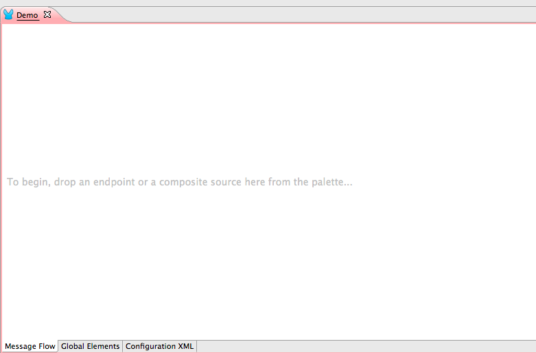

1. Global configuration of a Nuxeo Server

   We need to declare globally the Nuxeo connections that we will use. For this tutorial, we need to create a connection to Nuxeo demo server: http://demo.nuxeo.com (Administrator/Administrator). You can also use a local setup)
   
   1. Click on Global Elements tab, then Create, Filter using "Nuxeo" and choose the Cloud Connector
   
   1. Fill username Administrator, password Administrator, Server Name : http://demo.nuxeo.com Port:80 (or localhost:8080). 

   

   
   1. Save and go back to your flows view.

### Step 4: Implement a flow that uploads a file in Nuxeo

**Goal**: We want to poll a specific folder in the file system so that each time a file is dropped there, it is uploaded in Nuxeo, under the */default-domain/workspaces* folder.	

1. Drop a File endpoint in the middle of the flow editor. This will create a new flow called "DemoFlow1".

1. Select it, this opens the property editor for this element on the bottom part of the screen. Rename it "File_upload". Let other option as is.

1. Select the File Endpoint inside File_upload flow and edit its properties on the bottom part:
   - **Display name**: File polling
   
   - **Path**: select a path where you will drop the files for your tests
   
   - **Move to directory**: select a path where the files will be moved after having been imported to Nuxeo

   
   
    - Let other properties unchanged, and click back to the flow editor and save it.
    
   

1. Drop a "Nuxeo" transformer so as to transform the File in a Nuxeo Blob (required by the Nuxeo Connector). Set the following properties then go back to the flow editor and save:
   - **Display Name**: File To Blob
   - **Operation**: File to Blob

   

1. Drop a "Set Variable" component. Goal is to set the Nuxeo blob as a variable in the flow, so as to re-use it later, once the File document that will hold it has been created in Nuxeo. Fill the following properties on the component:
   - **Display Name**: Set as FileToUpload
   - **Operation**: Set Variable
   - **Name**: FileToUpload
   - **Value**: #[payload]
   
1. Drop a Nuxeo Connector at the end of the flow so as to create the document on the Nuxeo server that will hold the binary that we want to upload. Edit the following properties:
   - **Display Name**: Create document
   - **Config reference**: Choose the Nuxeo config of your choice (the one you created at the begining of this tutorial)
   - **Operation**: Choose *Create Document*
   - **Parent document reference**:/default-domain/workspaces
   - **Document Type**: File
   - **name of the document**:#[payload.file.name]
   - **properties**: choose "Create Object Manually" then
       1. Select the k:v Map <String,Object> row and click on the "+" icon.
       1. Fill the metadata that should be part of the document once created:
          - Name: dc:title  Value: #[filename]
          - Name: dc:description: Value : a decription of the file
          
            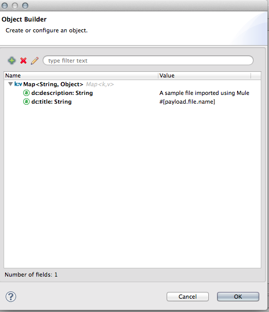
       1. Go back to the flow editor and save
    
1. Drop a Set Variable component. Goal is to save the document id that was just created so as to reference it when we will upload the file to the server. Use the following property values:
   - **Display Name**: Save Document id
   - **Operation**: Set variable
   - **Name**: FileDocumentId
   - **Value**: #[payload.id]
      
1. Drop a "Set Payload" component at the end, so as to get the blob (binary) back in the payload for uploading it in the step after to the newly created document, with SetBlob Nuxeo operation, using Nuxeo connector. Configure the following properties on the "Set Payload" component:
   - **Display Name**:Set the file as Payload 
   - **Value**:#[FileToUpload]
   
   
1. Drop a new Nuxeo Connector with the following properties
   - **Display Name** :Upload
   - **Config Reference**: Choose the Nuxeo server you want for creating the File Document
   - **Operation**: Set Blob
   - **Doc**: #[FileDocumentId]
   - **Blob Reference**: #[payload]
   - **XPath**: file:content
  
  
1. **Test the flow: right click on the file "Demo.mflow" > Run As > Mule Application, then drop  files under the import folder you chose, and check documents are created with the files on the Nuxeo sever.**

You can also copy past the [XML flow](resources/demo.mflow) and change a few config elements (mainly fs paths).

Note: You could also have used the operation "FileManager.Import" so as to create the document and upload the file in one step. In the flow we chose to detail, you controle everything: type of the created document, title, name of the file, … Using FileManager.Import will provide a much shorter flow, though with less control on what is done, but may suite simple file upload use case!

### Step 5: Playing with datasense: Exporting some of the repository content in XML

Nuxeo is compatible with Mule DataSense. Thanks to this feature, Mule Studio automatically fetches your Nuxeo repository schemas and properties definitions. Implementing complex mappings (as complex as a Nuxeo document type can be) is just about pulling some arrows between the two sides of the mapping.
In the sub-steps below, we show how to export and convert Nuxeo Data in XML , and how to import csv data as Nuxeo Documents. We will select some Note document type in Nuxeo and export in a Invoice domain XML grammar.

1. Create a new flow File, call it "datasense_sample"

1. Drop inside an http endpoint (that will allow to call the app from an url) with the following properties:
   - **Host**: localhost
   - **Port**: 8081
   - **Path**: datasense

1. Drop a Nuxeo Cloud Connector, select it on the flow and update the following properties:
   - **Display Name**: SELECT * FROM Note
   - **Config reference**: select the server you already configured in step 4
   - **Operation**: Query
   - **Query**: SELECT * FROM Note WHERE ecm:currentLifeCycleState != deleted
   - Other values can stay unmodified
   
    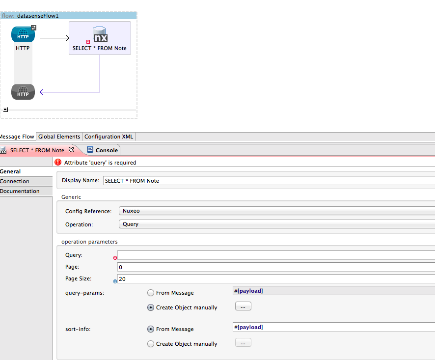
   
1. Drop a Nuxeo Transformer component: goal is to convert the list of documents returned by the Query operation into a list of maps, that the datamapper will know how to read easily. Edit the properties of the Nuxeo transformer:
   - **Display name**: Documents -- Maps
   - **Operation**: Documents to list of map
   
    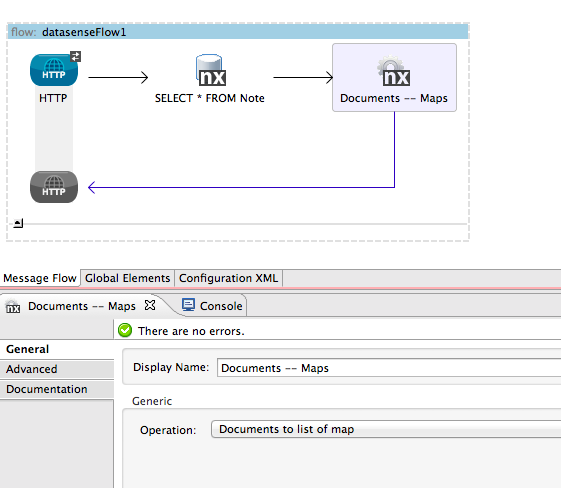
   
1. Drop a DataMapper component right after the Nuxeo Connector, select it on the flow and edit the mapping:
   1. **Display Name**: NotesToInvoices
   1. Configure the input format of the mapping (Left part)
        - **Type**: Connector
        - check By Type
        - check List
        - **Object**: Note (You can see here that Mule DataSense, thanks to Nuxeo Mule Connector DataSense support, was able to fetch all the document types that are in the repository)
   1. Configure the output format of the mapping
        - **Type**: XML
        - Select "From Exemple"
        - Click on "generate schema from XML" and select [this sample XML File](resources/invoices_XML_sample.xml) from your file system
        
        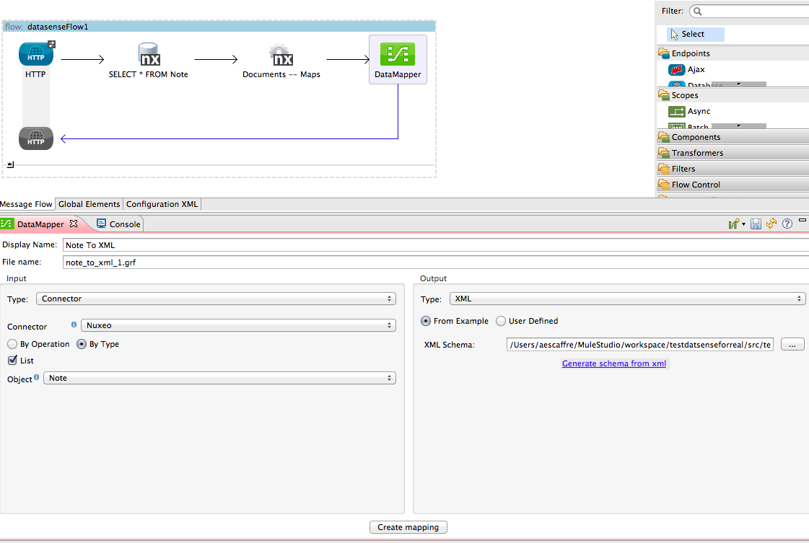
        
   1. Finally click on "Create Mapping" and configure the mapping:
        - Note that by default, the Studio will make an "Note" --> "Invoices" mapping, delete it in the top-middle "Element mapping" control and recreate a New one:
            - **Name**: For each Note --> Invoice
            - Select **Note** on the left, and **Invoice** on the right
            - Click on ok
            
            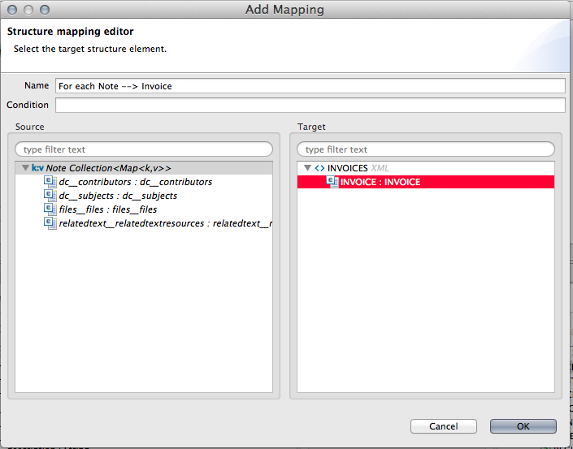
       - Drag arrows from the left to the right for implementing the mapping. See that once again thanks to Mule DataSense support by Nuxeo Mule Connector, all the properties of all the schemas are available for the Note document type. Note that  Nuxeo Mule Connector supports DataSense introspection of complex types.
       
            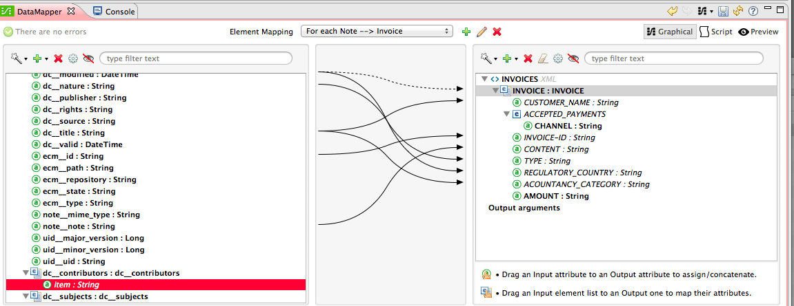
   
   1. You can run your flow (right click) and test it at the following URL: http://localhost:8081/datasense If you created Note documents before in Nuxeo, an XML file will be downloaded such as the following:
    
       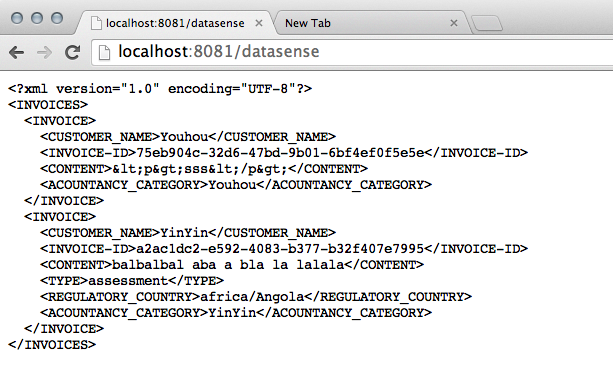

### Step 6: Playing with DataSense: Importing content from a flat file in the repository

We saw just before how to export content in a flat file, we will know do the contrary, very easily, once again leveraging Mule DataSense support of Nuxeo Mule Connector. We will import the XML file generated before and map it to a Note document type.

1. Create a new empty flow called "ImportingInNuxeo".

1. Drop a File component and configure it so as to listen to a local folder

1. Drop a datamapper component and edit the properties:
    - **Display Name**: WatchFolder
    - **Path**:  a folder to listen to (avoid choosing the same than on the first exercices   if you run both on the same project)

1. Configure the left part of your Datamapper (the input):
    - **Type**: XML
    - From Example, click on generate schema from XML (upload the previous output, you can download it [here](resources/invoices_XML_sample.xml) if you didn't get it)
1. Configure the right part (output) of the Datamapper:
   - **Type**: Connector
   - Choose **ByType**
   - Check **List**
   - Choose Note
 
1.  
Click on Generate Mapping. You 'll see that all the metadata available on the Note document type appear. (In a coming release of Nuxeo Platform (5.9.2) it will also work with your custom properties, implemented using Nuxeo Studio)

1. Design the mapping by pulling arrows from left to right. Let's say:
    - Customer_NAME -_> dc__title
    - CONTENT  --> note:note
    - REGULATORY_COUNTRY --> dc:coverage
   
   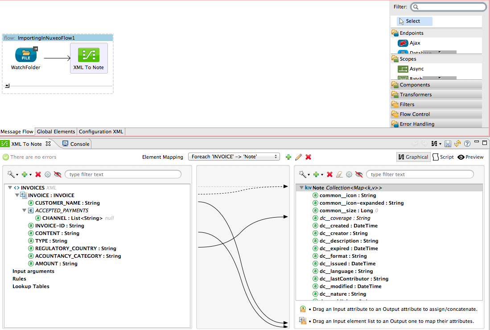
   
1. The outpout of the data mapper will be a list of maps (one per note). We need a collection splitter for calling in the step after the Create Document operation. **Drop a Collection Splitter** for this (no configuration to do on it).

1. Finally drop a Nuxeo Connector for creating a Note per element and configure it:
    - **Display Name**:Create a Note
    - **Config Reference**: Nuxeo
    - **Operation**: Create document
    - **Parent document reference**: /default-domain/workspaces
    - **Document type**: Note
    - **Name of the document**:#[payload.dc__title]
    - **Properties**: From Message , #[payload]
    
    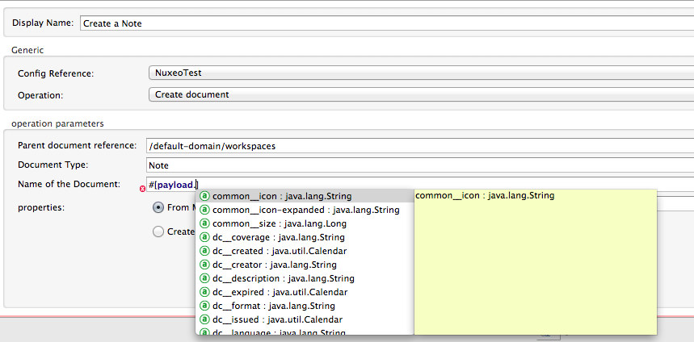
    
   This step shows the interest of Nuxeo implementing DataSense and of using the Datamapper in the flow. You have nothing to configure for the document creation, all the property will be created respecting what was done at the step before. Even better, when you want to configure for instance the name of the document, you can see that there is auto-completion after payload:  it proposes you all the available fields of the previous mapping, which makes the whole operation very easy!
   The final flow:
   
   
   
   To test it, just drop the sample XML file and check the resul in your Nuxeo, under the workspaces folder. This step may be the most impressive considering the very few configuration that was required for making it work.
   
   
### Step 7: Listening to events happening in a Nuxeo instance, from Mule

 The Nuxeo Mule Connector allows to litterally "listen" to a Nuxeo instance, so as to go further in a Mule flow execution only when some specific events happen.
 In this sample, we are going to "listen" a local Nuxeo instance so that each time a document of type File is created, we recreate a File on the demo.nuxeo.com instance with the same binary. This time we will use the operation "Import File" for creating the file (instead of doing "createDocument then SetBlob). For some historical reasons, the corresponding operation requires to have in the automation context the ref of the parent document in which to create the file. Hence the "Groovy" step in the flow construction below.
 
 1. Create a new empty flow called "eventpolling".
 
 1. Make sure we have now two Global Elements configured: one for the Nuxeo localhost and one for the Nuxeo demo
 
 1. Drop a Nuxeo Connector component. As it is the first one on the flow, you will see it behaves differently than usual. The only operation available is "Listen to events". You still have to select the Config reference: Local Nuxeo (Nuxeo on the screenshot).
 
      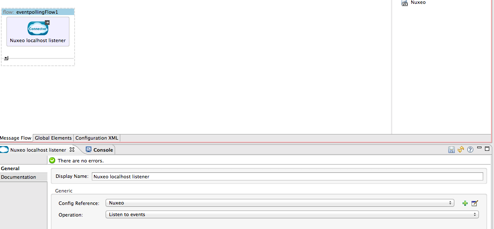
 
  This component will launch the rest of the flow as many time as it receives some Nuxeo Audit Events. 
  
 1. You can drop a Logger component, so as to see the structure of an event. At the stage, you can start your flow. If you do a modification of a document in Nuxeo (or a document creation), you will see in the console, thanks to the logger component, a message of this kind:

          org.mule.DefaultMuleMessage
          {
               id=b1a1dd16-680f-11e3-94a8-0fdac6f67b8f
                payload=org.nuxeo.mule.poll.NuxeoSimpleEvent
                correlationId=<not set>
                correlationGroup=-1
                correlationSeq=-1
                encoding=UTF-8
                exceptionPayload=<not set>

          Message properties:
            INVOCATION scoped properties:
            INBOUND scoped properties:
              category=eventDocumentCategory
              comment=
              docLifeCycle=project
              docPath=/default-domain
              docType=Domain
              docUUID=82b1583a-70be-43cc-b838-b775f689b2d8
              entity-type=logEntry
              eventDate=2013-12-18T19:10:32.834+01:00
              eventId=documentModified
              id=2736
              logDate=2013-12-18T19:10:33.075+01:00
              principalName=Administrator
              repositoryId=default
            OUTBOUND scoped properties:
              MULE_ENCODING=UTF-8
            SESSION scoped properties:
          }
   
  
1. Then Drop an Expression component, so as to filer out all NuxeoSimpleEvent objects that doesn't have docType=File as a property:
    - **Display Name**: docType==File
    - **Expression**: #[payload.docType=='File']
      
      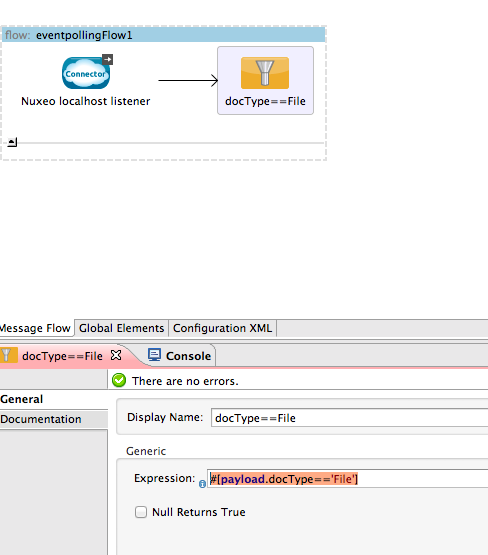

1. Drop the Groovy component, and copy inside the following script:

        import org.mule.api.transport.PropertyScope;
        def map = ["currentDocument":"/default-domain/workspaces/finance"]
        message.setProperty('automationContext', map, PropertyScope.INBOUND) 
        
   The importFile operation will include in the request made to the server the automationContext hashmap, that wil be fullfil the automation "context" hashmap (and that is required in the case of the importFile automation operation)

1. Then Drop a Nuxeo Connector, so as to get the binary of the corresponding document from the local Nuxeo:
   - **Display Name**: Import File on Demo
   - **Config reference**: Nuxeo (localhost)
   - **Operation**: Get blob
   - **Doc**: #[message.inboundProperties['docUUID']]
   - **Xpath**: file:content

     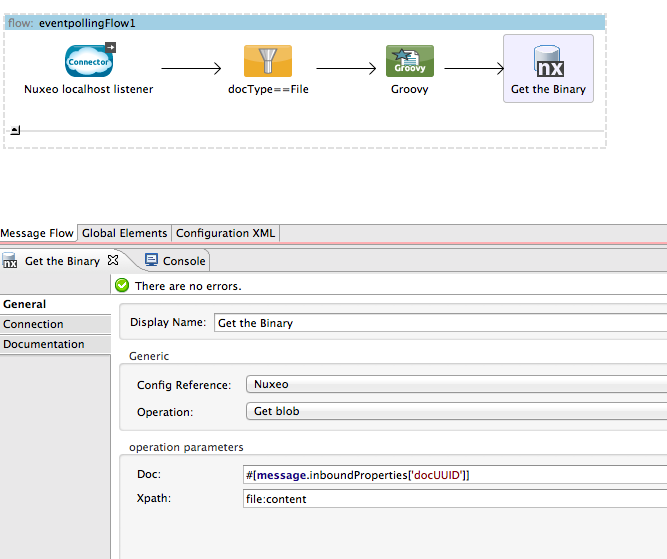

1. Finally, drop another Nuxeo Connector, configre it on the demo.nuxeo.com server and use the importFile operation:
   - **Display Name**: Import File on Demo
   - **Config reference**: NuxeoDemo (demo.nuxeo.com)
   - **Operation**: Import File
   - **Doc**: #[payload]
   
     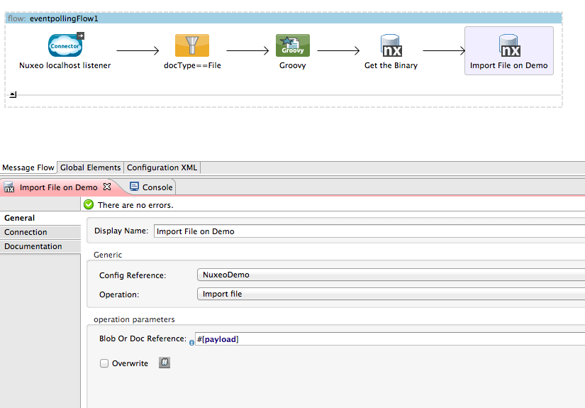
 
 ***If you log the Nuxeo local instance and create a File with a binary inside, then after a while go to http://demo.nuxeo.com (Administrator/Administrator), you will see just under the domain that the file has been created there too.***

### Other Resources

For more information on:

- Nuxeo Platform, please visit [http://doc.nuxeo.com/](http://doc.nuxeo.com/display/MAIN/Nuxeo+Documentation+Center+Home)

- Nuxeo Automation API, please visit [http://doc.nuxeo.com/display/NXDOC/Platform+APIs#PlatformAPIs-RESTAPI](http://doc.nuxeo.com/display/NXDOC/Platform+APIs#PlatformAPIs-RESTAPI)

- Mule AnyPoint™ connectors, please visit [http://www.mulesoft.org/connectors](http://www.mulesoft.org/connectors)

- Mule platform and how to build Mule apps, please visit [http://www.mulesoft.org/documentation/display/current/Home](http://www.mulesoft.org/documentation/display/current/Home)

